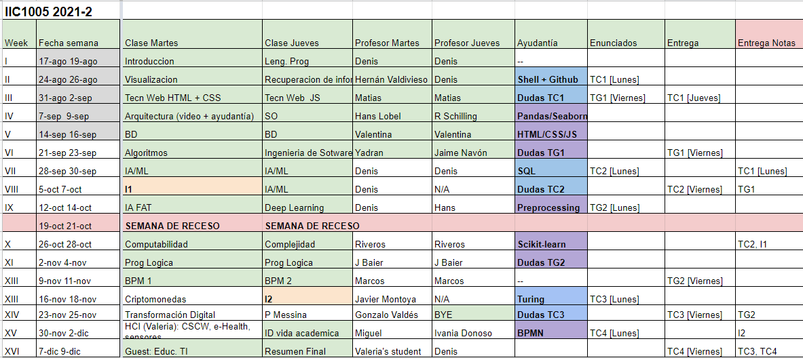

# Syllabus
Página principal del curso **IIC1005 - Computación: Ciencia y** 
**Tecnología del Mundo Digital**.
Para dudas sobre la materia o enunciados de tareas puedes preguntar en las issues.

## Equipo Docente

### Profesor

| Nombre                  | Correo                        |
| ----------------------- | ----------------------------- |
| Denis Parra             | dparras@uc.cl                 |

### Ayudantes

| Nombre              | Correo                 | Tarea     |
| ------------------- | -----------------------|-----------|
| Juan Pablo Olivares | jpolivares3@uc.cl      | TC1       |
| Jose Quintana       | josemiguelquinta@uc.cl | TC1       |
| Valentina Álvarez   | vjalvarez@uc.cl        | TG1 y TC2 |
| Michelle Madrid     | msmadrid@uc.cl         | TG1 y TC3 |
| Constanza Olate     | clolate@uc.cl          | TC2       |
| Ricardo Schilling   | reschilling@uc.cl      | TG2       |
| Astrid San Martín   | aesanmar@uc.cl         | TG2       |
| Sofía Olmedo        | sofia.olmedo.s@uc.cl   | TC4       |
| Maite Madalosso     | maite.madalosso@uc.cl  | TC3 y TC4 |

## Contenidos
- Visualización de información.
- Recuperación de información.
- Tecnologías web.
- Arquitectura de computadores y sistemas operativos.
- Introducción a las bases de datos.
- Algoritmos.
- Ingeniería de Software.
- Aprendizaje de máquina.
- Sistemas Recomendadores
- Computabilidad y complejidad.
- Programación en lógica.
- Otros temas: Criptomonedas, Educación TI, Mobile & Cloud.

## Evaluación
La **nota de presentación** se calculará como 30% notas de controles y 
70% notas de tareas. Las actividades evaluadas del curso son las 
siguientes:
- 2 controles de lectura sobre algunos de los tópicos vistos en el 
semestre y artículos en inglés.
- 2 tareas grandes.
- 4 tareas chicas.

La **nota final** del curso se calcula como 30% el examen y 70% la nota 
de presentación. Se podrán **eximir** del examen si:
- No tienen notas bajo 4.0 y promedio  >= 5.5; o
- Con máximo una nota roja y promedio >= 6.0.

### Fechas de evaluaciones escritas

- Control 1: 5 de Octubre.
- Control 2: 25 de Noviembre.
- Exámen: 14 de Diciembre.

### Planificación del curso:
Work in progress :)

